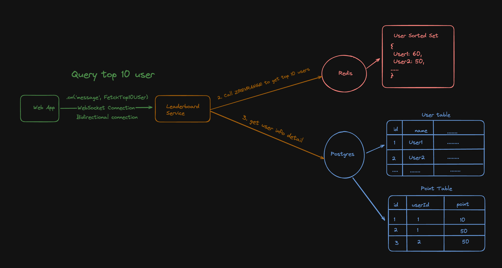

# Technical Specification

## Epic

### Leaderboard feature

1. Return the list of 10 users with highest scores.
2. Authorized users are allowed to update their scores.
3. Live update on score changes.

### Architecture Design

1. Fetch top 10 scores

2. Write new scores & Update dashboard

### List of required APIs

| HTTP Method |      API       |         Function Name | Is JWT Protected |
| :---------- | :------------: | --------------------: | :--------------: |
| GET         | /api/v1/scores | FetchTop10Leaderboard |        NO        |
| POST        | /api/v1/scores |     UpdatePlayerScore |       YES        |

### Tasks

#### 1. Authentication & Authorization

##### 1.1 Definition of Done

- Protect routes that are mark as "Is JWT Protected"
- Implement JWT signing & verification flow
- Recommended JWT Implementation approach - Using a pair of Access Token & Refresh Token

1. Access Token should be valid for 10 minutes
2. Refresh Token should be valid for a week

##### 1.2 Implementation flow

- Because the implementation is not required in the test. So, I will assume that if implemented, I will satisfy my Definition of Done.

#### 2. Get the list of Top 10 Leaderboard Players

##### 2.1 Definition of Done

- API Name: [GET] /api/v1/scores

- The Web App must render the latest Top 10 Players. The WebApp and Leaderboard Service must establish a relationship with leaderboard service. There are several options to achieve it.

  - WebSocket - Sub Miliseconds Update but CPU & Memory Expensive (Stateful)
    > [!NOTE]
    > WebSocket is chosen in My Architecture Design. Alternatives are listed below.
  - Long Pooling - Miliseconds Update but less CPU & Memory Expensive && Easy to implement (Stateless)
  - Short Pooling - Miliseconds Update but more expensive than Long Pooling, because of chattiness (Stateless) - Rarely used.

- Provide low response time (<200ms)

  - Leverage Sorted Sets DSA in Redis to rank players based on scores - All Players are ranked in this data structure
  - Cache the top 10 player in Redis.
  - Persist user info & individual player scoring in persistent medium
    > [!NOTE]
    > Recommended Postgres

##### 2.2 Architecture Design

#### 3. Insert Player's new scores

##### 3.1 Definition of Done

- API Name: [POST] /api/v1/scores

- Verify player's identify using JWT token in the request **Authorization** header

- Check that the player still exists in the postgres database before inserting new scores

- Insert the score in **POINT TABLE**

- Use ZINCRBY to update player's accumulated score in Redis's Sorted Set

- [OPTIONAL] Invalidate the Top10 cache (if you take the optional step above)

- Notify WebSocket connection if there is a change in Top 10 Leaderboard

  > [!IMPORTANT]
  > The reference to these WebSocket connections are stored in the Leaderboard Service Heap Memory. If the service crashes, all connections are technically lost.
  > So it is very important to have some logic to handle the re-establishment of dropped connection

##### 3.2 Architecture Design

